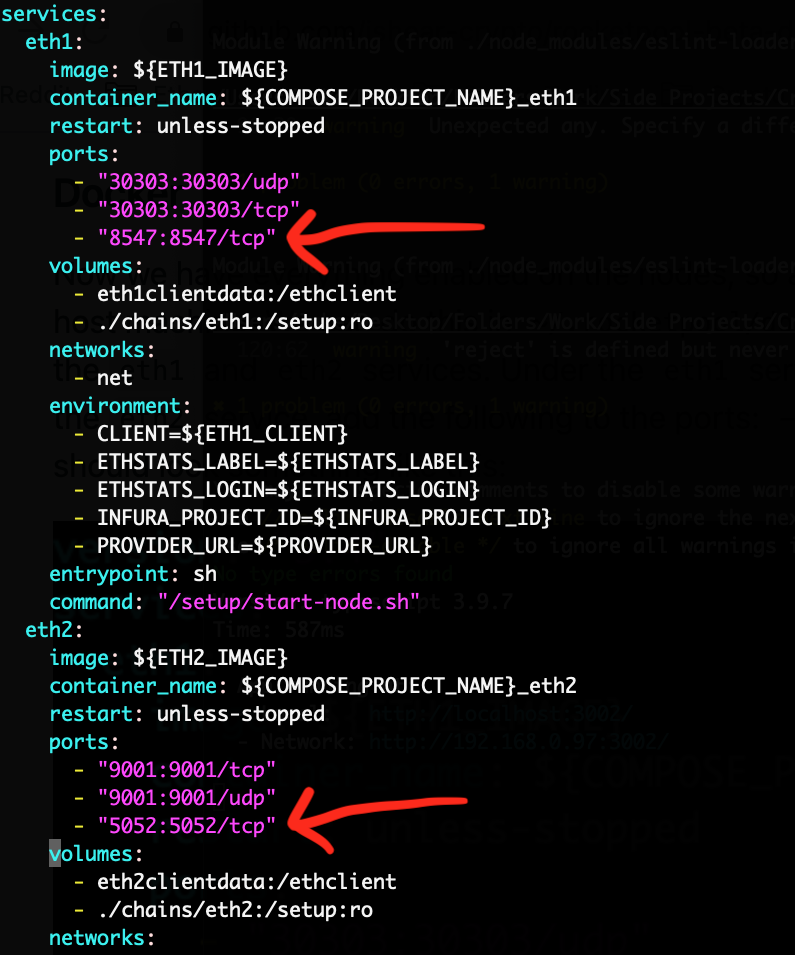

# Rocket Pool Pyrmont Beta Dashboard
Welcome to the Rocket Pool beta dashboard! This dashboard can be used to get updates on the nodes in the Rocket Pool network. The dashboard is currently being hosted on https://rocketpoolbeta.tk

In its current implementation, the dashboard gets the state of the Rocket Pool network using the Eth1 and Eth2 nodes running on the machine. In other words, the dashboard has to be opened on the same machine that the Rocket Pool stack is being run (or where an SSH tunnel is being used).

Note: Currently, only Geth and Lighthouse are supported. If anyone wants to play around with Prysm or Infura, feel free to contribute :) I'll try to add Prysm support soon, but using the dashboard with Infura is probably a bad idea because it will eat up requests.

Security note: You do NOT need to expose any ports to the public for this to work. This must be open on the same host as your nodes (unless you have SSH tunnels in place), as it simply queries `localhost` to connect to your node. Again, do NOT expose ports on your host to the public.

## Updating Geth and Lighthouse to allow API calls
In order for the dashboard to get the data from the nodes, the nodes need to be updated to expose their API (again, this is exposing it only to `localhost`, NOT to the public).

### Geth
The dashboard uses WebSockets to get the information from the Geth node. So, we need to enable the WebSocket server on the node in the start script. For this example, I will use port 8547 as the WebSocket port for Geth. You can use any port you want. If you choose a different port, make sure to use the same port that you chose when updating Docker below.

Open up `~/.rocketpool/chains/eth1/start-node.sh`. We need to add the following arguments to the Geth startup script: `--ws --ws.port 8547 --ws.api eth,net,web3 --ws.addr 0.0.0.0 --ws.origins '*'`. The startup script should look something like this:

### Lighthouse
The dashboard uses the HTTP server on the Lighthouse node to get the information.

Open up `~/.rocketpool/chains/eth2/start-beacon.sh`. We need to add the following arguments to the Lighthouse startup script: `--http-allow-origin '*'`. The startup script should look something like this:

### Docker
Now we have everything enabled on the nodes, so all we have to do is expose the Docker ports for the nodes to the host machine. We can do this in `~/.rocketpool/docker-compose.yml`. We need to update the `ports` attribute in the `eth1` and `eth2` services. Under the `eth1` service, add the following to the ports: `- "127.0.0.1:8547:8547/tcp"`. Under the `eth2` service, add the following to the ports: `- "127.0.0.1:5052:5052/tcp"`. That's it! The `docker-compose.yml` file should look something like this:

### Activating the changes
Now that we've made all the necessary changes, just run `rocketpool service pause && rocketpool service start` so that they take effect. Now, go enjoy the dashboard at https://rocketpoolbeta.tk!

### Again, nothing should be exposed to the public!!!
Everything we've done here is exposing ports internally from the Rocket Pool stack to the machine it is running on. There is no need to expose any of these ports to the public. I feel like I've said this enough times now, so hopefully nobody makes that mistake. Exposing uneccessary ports to the public just increases potential attack vectors -- you should only open up a port when you understand why you are doing it.

## Using the Dashboard
Now that your nodes are accepting API calls, using the dashboard is easy! Just type in the Eth1 and Eth2 ports for their respective APIs, and then query the node data! Please reach out to @jshear on the Rocket Pool discord with any questions, errors, or suggestions.
